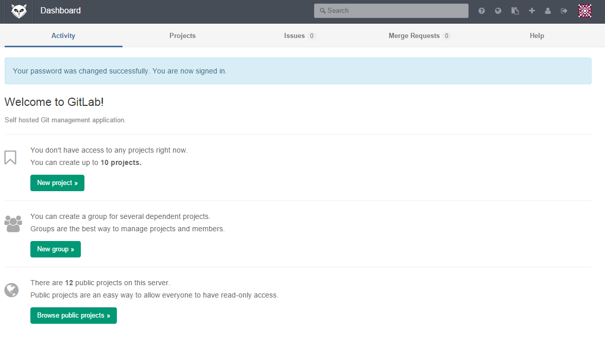

# Environment Set Up

Git is a code management program.

## First of All
You need to have a account first. Just tell the admin that you want to create the new account.

And we recommend you the [SourceTree](http://www.sourcetreeapp.com/) which has simple GUI for each branch! Download and install it.

Go to check your mailbox for the mail sent from server and reset your password.

##### Account done!

#### We use the account "test" for example below:

