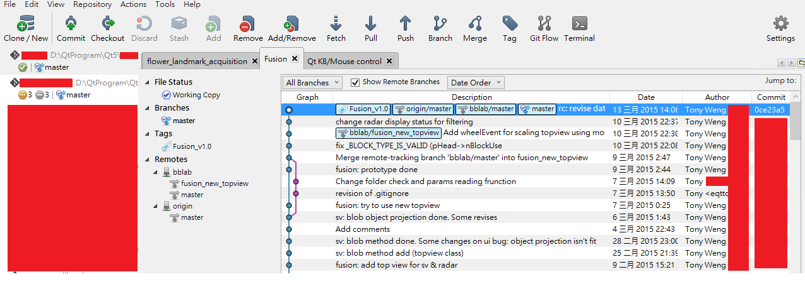
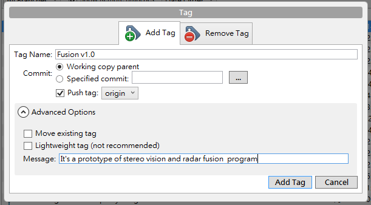
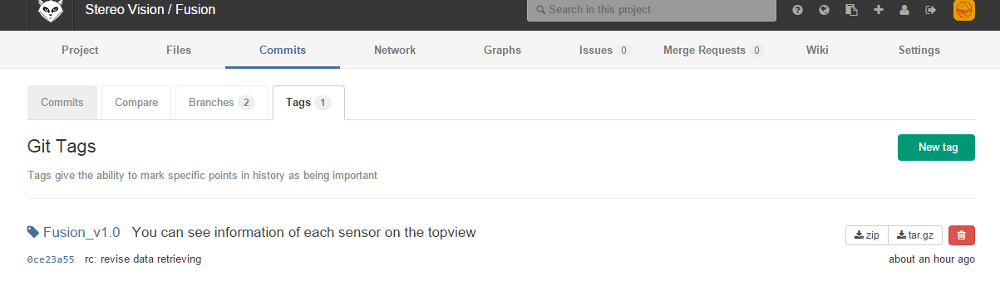

# GUI control on SourceTree

The image shown below is the gui of SourceTree.

# Clone / New

# Commit

# Checkout

# Discard

# Stash

# Add / Remove

# Fetch

# Pull, Push

# Branch

# Merge

# Tag
This is good for you to see the clear released version. Just press that icon and type in tag name and messages and choose the **remote** which you want to upload.

Here you can see that there's a compressed file that you can download.

#Terminal