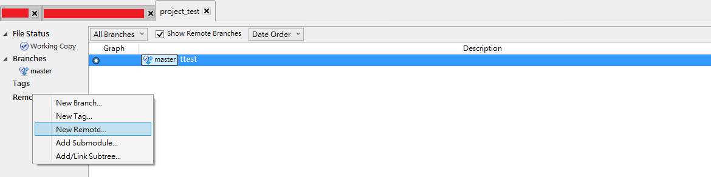
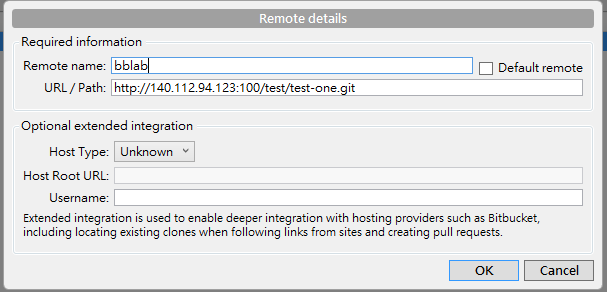
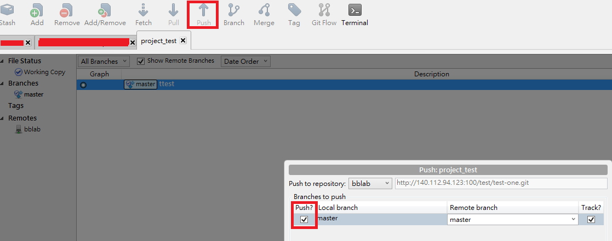

# Remote setting

If you want to push your project to the server. First go to project page on the server web and copy the dir.

Go to SourceTree and right click the "Remotes" and add "New Remote".

Paste the dir on it and press OK for all!

Try to push up your project to the server by clicking "Push" and click the "Push ?".

