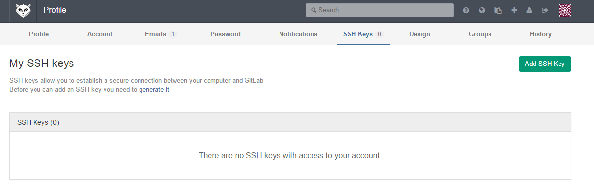
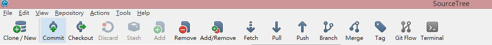
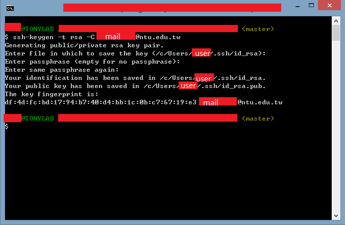
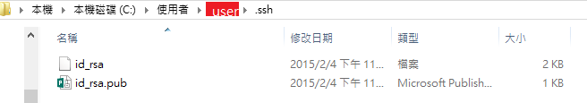
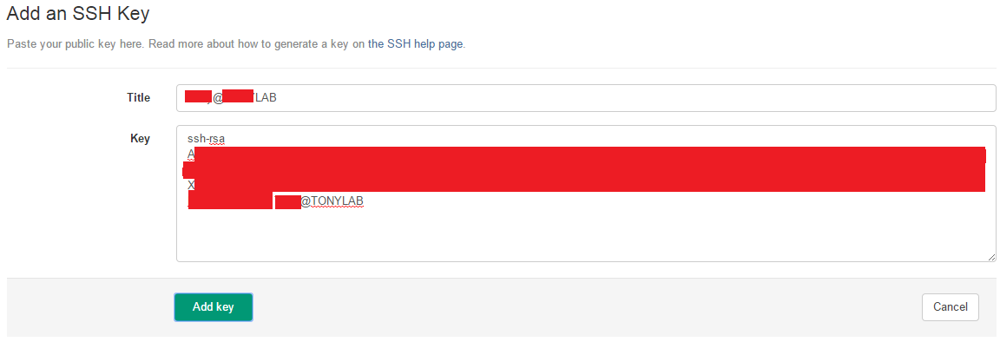
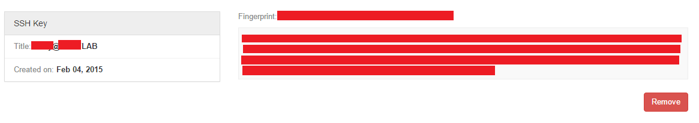

# SSH Key Generation
Now we're going to generate your own SSH key for connecting local host and server.

click "Profile setting" (top right) -> "SSH Keys"

If you dont have any SSH key, click "[generate it](http://140.112.94.123:100/help/ssh/ssh)".

Open your SourceTree and open the "Terminal" (a.k.a. Git Bash) and type the codes () in the [guide](http://140.112.94.123:100/help/ssh/ssh).
##### ssh-keygen -t rsa -C "$your_email"

After that, you may find your key files "**id_rsa (private)**" and "**id_rsa.pub (public)**" in the folder "**C:\Users\UserName\.ssh**".

## Import

Click "**Add SSH Keys**" and open your id_rsa.pub with textbook, NotePad++....etc. Copy paste your public key.

